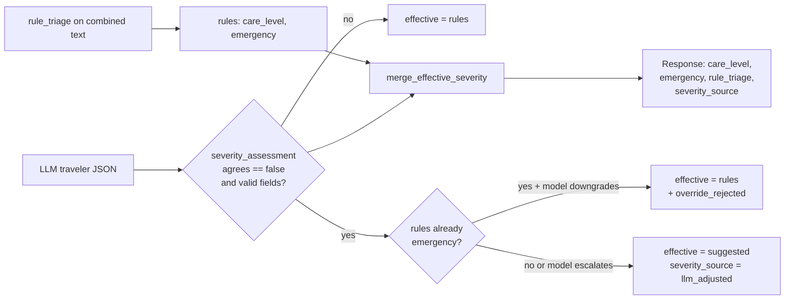

# Travel Care AI

Educational **decision-support** demo for **travelers**: rule-based triage hints, a small **local RAG** corpus (`data/corpus.jsonl`), optional **OpenAI** wording, and **Google Maps JavaScript + Places** for nearby hospitals when the traveler searches a place.

This is **not** a medical device and **not** a diagnosis.

## Quick start

```bash
cd travelcareAI
python3 -m venv .venv
source .venv/bin/activate   # Windows: .venv\Scripts\activate
pip install -r requirements.txt
cp .env.example .env
# Edit .env: GOOGLE_MAPS_API_KEY (and optionally OPENAI_API_KEY, DEFAULT_TRAVEL_LOCATION)
uvicorn app.main:app --reload --host 127.0.0.1 --port 8000
```

Open [http://127.0.0.1:8000/](http://127.0.0.1:8000/).

## Environment

| Variable | Purpose |
|----------|---------|
| `GOOGLE_MAPS_API_KEY` | Browser key with **Maps JavaScript API**, **Places API**, and **Geocoding API** enabled (Geocoding turns typed addresses into map coordinates). Restrict by HTTP referrer to your dev URL in Google Cloud Console. |
| `OPENAI_API_KEY` | Optional. If unset, the server returns rule + RAG citations only (no `llm` block). |
| `OPENAI_MODEL` | Optional, default `gpt-4o-mini`. |
| `DEFAULT_TRAVEL_LOCATION` | Optional default for trip context (e.g. `Paris, France`) when the client does not send `location` on `/api/assist`. |

## API

- `GET /api/public-config` — returns whether Maps / OpenAI are configured, optional `defaultTravelLocation`, and the Maps key for the browser when configured.
- `POST /api/assist` — JSON `{ "message": "...", "language": "en", "location": "City, Country" }` → care level, citations, optional LLM JSON. Field `location` is optional; omit or leave empty for location-agnostic behavior unless `DEFAULT_TRAVEL_LOCATION` is set.

## Architecture (request flow)

High-level flow for a single `POST /api/assist` call (see `app/main.py`, `app/triage.py`, `app/rag.py`, `app/research_agent.py`, `app/llm.py`, `app/severity_resolution.py`).

```mermaid
flowchart TB
  subgraph client["Client (browser)"]
    UI[Session / chat + trip context]
    UI -->|POST /api/assist| API
  end

  subgraph server["FastAPI: assist()"]
    API[Receive message, chat_history, strategy, location, research_tools flag, map coords]

    API --> COMBINE[Build combined text for signals]
    COMBINE --> TRIAGE["rule_triage(combined)\n(regex / keyword layers)"]
    TRIAGE --> RULES["Rules output:\ncare_level, emergency,\nmatched_rules, rationale"]

    COMBINE --> RAGQ[Build RAG query]
    RAGQ --> RAGBRANCH{query_strategy == single_turn_tools\nand OpenAI key?}
    RAGBRANCH -->|yes| PLAN["LLM: plan_retrieval_subqueries\n(extra English keywords)"]
    PLAN --> RAGM["rag.retrieve_merged(...)"]
    RAGBRANCH -->|no| RAG1["rag.retrieve(rag_query)"]
    RAGM --> CITES["citations from chunks"]
    RAG1 --> CITES

    API --> GEO{Maps key + location,\nmissing lat/lng?}
    GEO -->|yes| GEOCODE[Geocode address]
    GEO -->|no| MAPOK[Use client or prior coords]
    GEOCODE --> MAPOK

    MAPOK --> LOCAL{Maps + coords?}
    LOCAL -->|yes| DESTCTX[Destination local time context]
    LOCAL -->|no| NORESEARCHCTX[Skip local context]
    DESTCTX --> RESQ
    NORESEARCHCTX --> RESQ

    subgraph research["Optional: research tool loop"]
      RESQ{run_research?\nOpenAI + keys + not disabled}
      RESQ -->|yes| RLOOP["research_agent:\nOpenAI chat + tools\n(Places, web_search, ...)"]
      RLOOP --> RDIG["Structured research +\ndigest text"]
      RESQ -->|no| NORES[No research payload]
    end

    RDIG --> BASE
    NORES --> BASE

    subgraph basebuild["Assemble base JSON"]
      BASE["base: citations, disclaimer,\nmap coords, research fields,\nmatched_rules, rule_rationale,\nseverity_source=rules,\nrule_triage snapshot"]
    end

    RULES --> BASE

    subgraph llm_main["Optional: main traveler LLM"]
      KEY{OPENAI_API_KEY?}
      BASE --> KEY
      KEY -->|no| SKIP["llm = null\nllm_skip_reason"]
      KEY -->|yes| AUG["llm.augment_with_openai(...)\n(server_decision + citations +\ndigest/structured + schema)"]
      AUG --> PARSE["Parse JSON →\n_normalize_traveler_llm_json"]
      PARSE --> LLMOUT["base.llm = traveler JSON\n(incl. optional severity_assessment)"]
    end

    subgraph severity["Severity merge"]
      MERGE["merge_effective_severity(rules, llm_out)"]
      LLMOUT --> MERGE
      MERGE --> EFF["Top-level care_level,\nemergency = effective"]
      MERGE --> SRC{severity_source}
      SRC -->|rules| SRULES["Keyword triage only"]
      SRC -->|llm_adjusted| SLLM["Model disagreed\n(valid payload)"]
      MERGE --> REJ{Override rejected?\n(emergency downgrade blocked)}
      REJ -->|yes| REJFL["llm_severity_override_rejected +\nreason"]
    end

    SKIP --> RESP
    EFF --> RESP
    REJFL --> RESP

    RESP[HTTP JSON response]
  end

  RESP --> UI2[UI: report, tags, chat bubble,\nexport markdown]
```

### Severity merge (detail)



## Emergencies while traveling

Use the **official emergency and police numbers for your destination** (they differ by country). This app does not replace local emergency services.

## Next steps (paper / product)

- Replace overlap RAG with embeddings + eval scenario bank.  
- Add facility-type routing (clinic vs ER) from triage output.  
- Curate destination-specific official health URLs into the corpus with snapshots.
