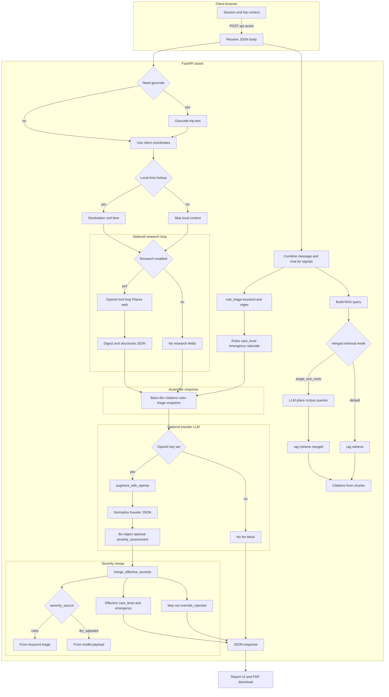
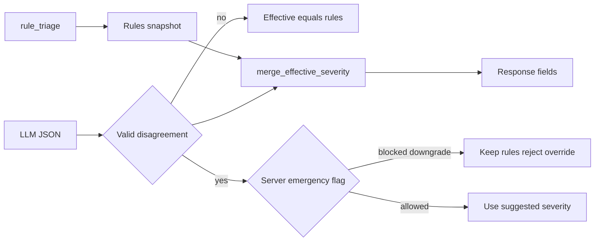

# Travel Care AI

Educational **decision-support** demo for **travelers**: rule-based triage hints, a small **local RAG** corpus (`data/corpus.jsonl`), optional **OpenAI** wording, and **Google Maps JavaScript + Places** for nearby hospitals when the traveler searches a place.

This is **not** a medical device and **not** a diagnosis.

## Quick start

```bash
cd travelcareAI
python3 -m venv .venv
source .venv/bin/activate   # Windows: .venv\Scripts\activate
pip install -r requirements.txt
cp .env.example .env
# Edit .env: GOOGLE_MAPS_API_KEY (and optionally OPENAI_API_KEY, DEFAULT_TRAVEL_LOCATION)
uvicorn app.main:app --reload --host 127.0.0.1 --port 8000
```

Open [http://127.0.0.1:8000/](http://127.0.0.1:8000/).

**Download report** saves a **PDF** (generated in the browser via [jsPDF](https://github.com/parallax/jsPDF) from the CDN; allow network access to `cdnjs.cloudflare.com` if you use a strict blocker).

## Environment

| Variable | Purpose |
|----------|---------|
| `GOOGLE_MAPS_API_KEY` | Browser key with **Maps JavaScript API**, **Places API**, and **Geocoding API** enabled (Geocoding turns typed addresses into map coordinates). Restrict by HTTP referrer to your dev URL in Google Cloud Console. |
| `OPENAI_API_KEY` | Optional. If unset, the server returns rule + RAG citations only (no `llm` block). |
| `OPENAI_MODEL` | Optional, default `gpt-4o-mini`. |
| `DEFAULT_TRAVEL_LOCATION` | Optional default for trip context (e.g. `Paris, France`) when the client does not send `location` on `/api/assist`. |

## API

- `GET /api/public-config` — returns whether Maps / OpenAI are configured, optional `defaultTravelLocation`, and the Maps key for the browser when configured.
- `POST /api/assist` — JSON `{ "message": "...", "language": "en", "location": "City, Country" }` → care level, citations, optional LLM JSON. Field `location` is optional; omit or leave empty for location-agnostic behavior unless `DEFAULT_TRAVEL_LOCATION` is set.

## Architecture (request flow)

High-level flow for a single `POST /api/assist` call (see `app/main.py`, `app/triage.py`, `app/rag.py`, `app/research_agent.py`, `app/llm.py`, `app/severity_resolution.py`).



### Severity merge (detail)



## Emergencies while traveling

Use the **official emergency and police numbers for your destination** (they differ by country). This app does not replace local emergency services.

## Next steps (paper / product)

- Replace overlap RAG with embeddings + eval scenario bank.  
- Add facility-type routing (clinic vs ER) from triage output.  
- Curate destination-specific official health URLs into the corpus with snapshots.
